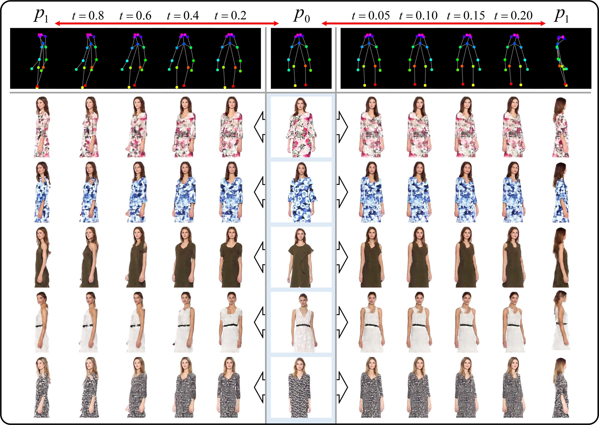

# A Novel Human Image Sequence Synthesis Method by Pose-Shape-Content Inference <br><sub>Official Pytorch implementation for TMM 2022 paper</sub>

### [ [Paper] ](https://ieeexplore.ieee.org/abstract/document/9903568)
Abstract: In online clothing sales, static model images only describe specific clothing statuses towards consumers. Without increasing shooting costs, it is a subject to display clothing dynamically by synthesizing a continuous image sequence between static images. This paper proposes a novel human image sequence synthesis method by pose-shape-content inference. In the condition of two reference poses, the pose is interpolated in the pose manifold controlled by a linear parameter. The interpolated pose is transferred into the end shape by AdaIN and the attention mechanism to infer target shape. Then the content in the reference image is transferred into this target shape. In the content transfer, the visual features of the human body cluster and clothing cluster are extracted, respectively. And the Sobel gradient is adopted to extract clothing texture variation. In the feature inferring, the multiscale feature-level optical flow warps source features, and style code infusion infers new region content without source features. Extensive experiments demonstrate that our method is superior in inferring clear layouts and transferring reasonable content compared to the pose transfer baselines. Moreover, our method has been verified to apply in parsing-guided image inference and dynamic display based on the pose sequence. 

## Requirements
```
conda create -n psc python=3.7
conda activate psc
conda install pytorch==1.10.1 torchvision==0.11.2 torchaudio==0.10.1 cudatoolkit=11.3 -c pytorch -c conda-forge
pip install -r requirements.txt
```
## Inference
You can access the FashionVideo dataset in this [link](https://vision.cs.ubc.ca/datasets/fashion/). You can process it to obtain the parsing and pose by [GrapyML](https://github.com/Charleshhy/Grapy-ML) and [HMR](https://github.com/akanazawa/hmr). 

The test dataset structure is recommended as:
```
+—test
|   +—I0
|      +- e.g. 00001.jpg
|   +—P0
|      +- e.g. 00001.csv
|   +—P1
|      +- e.g. 00001.csv
|   +—S0
|      +- e.g. 00001.png
```
We provide the pre-trained models of psc in this [link](https://drive.google.com/drive/folders/1wxTZX-RYzOkujLE3B2TdTqsE-M6UDQSV?usp=sharing). Download them and copy them to dir 'checkpoint'. Then run the command. 
```
python test.py --data_dir data/test --output_dir output --process_dir process
```
## Running Training
The train dataset structure is recommended as:
```
+—train
|   +—back_img
|      +- e.g. 00001.jpg
|   +—back_sg
|      +- e.g. 00001.png
|   +—front_img
|      +- e.g. 00001.jpg
|   +—front_sg
|      +- e.g. 00001.png
|   +—left_img
|      +- e.g. 00001.jpg
|   +—left_sg
|      +- e.g. 00001.png
|   +—right_img
|      +- e.g. 00001.jpg
|   +—right_sg
|      +- e.g. 00001.png
|   +—mid0_img
|      +- e.g. 00001.jpg
|   +—mid0_sg
|      +- e.g. 00001.png
|   +—mid1_img
|      +- e.g. 00001.jpg
|   +—mid1_sg
|      +- e.g. 00001.png
|   +—mid2_img
|      +- e.g. 00001.jpg
|   +—mid2_sg
|      +- e.g. 00001.png
|   +—mid3_img
|      +- e.g. 00001.jpg
|   +—mid3_sg
|      +- e.g. 00001.png
|   +—joint
|      +- e.g. 00001.csv
|   +—joint_interpolation
|      +- e.g. 00001.csv
```
We provide a demo training dataset. You can follow them. Then run the command to train PM-Net, AA-Net, and CT-Net. 
```
python train.py --data_dir data/train --model pm
```
```
python train.py --data_dir data/train --model aa
```
```
python train.py --data_dir data/train --model ct
```

## Citation
Please consider citing our work if you find it useful for your research:
```
@ARTICLE{9903568,
  author={Fang, Naiyu and Qiu, Lemiao and Zhang, Shuyou and Wang, Zili and Hu, Kerui and Dong, Liangyu},
  journal={IEEE Transactions on Multimedia}, 
  title={A Novel Human Image Sequence Synthesis Method by Pose-Shape-Content Inference}, 
  year={2022},
  pages={1-14},
  doi={10.1109/TMM.2022.3209924}}
```
