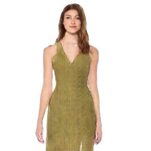
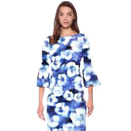

# Official implementation - "A Novel Human Image Sequence Synthesis Method by Pose-Shape-Content Inference"

## Introduction
we proposed three networks for solving the issue of synthesizing continuous image.  
PM-Net: intepolate pose between two end poses controlled by a parameter;  
AA-Net: infer instance-level shape from pose;  
CT-Net: transfer content with specific mechanisms;

## Note
we will release our code and pretrained model after publication.

## Example

